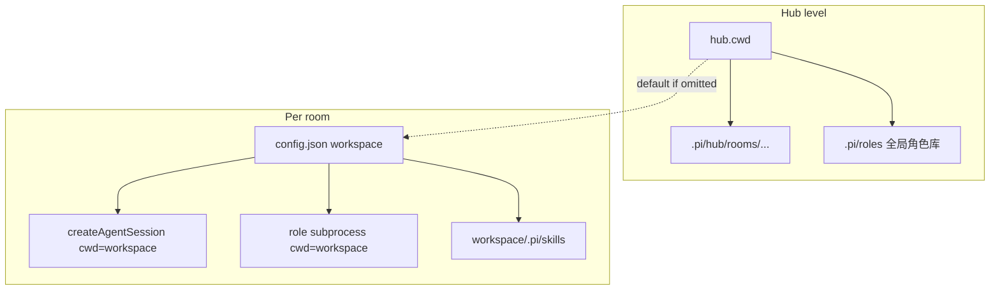

# 每房间 workspace 实现计划

## 目标

- **Hub `cwd`**（[`hub.json`](e:/self/pi/.pi/hub.json) / `PI_HUB_CWD`）：Hub 元数据根目录（`.pi/hub/rooms.json`、会话 jsonl、房间 `config.json`）。
- **房间 `workspace`**：该房间代理与子进程执行 read/write/bash 等工具的根目录；**仅在创建房间时设置，之后不可改**（用户确认）。
- **未配置**：已有房间无 `workspace` 时，运行时等同于 hub `cwd`（向后兼容）。



## 当前缺口（需改动）

| 位置 | 现状 |
|------|------|
| [`room-manager.ts`](packages/hub/src/room-manager.ts) | 所有房间使用 `this.options.cwd` |
| [`RoomConfigFile`](packages/hub/src/room-registry.ts) | 无 `workspace` |
| [`create_room`](packages/hub/src/hub-admin.ts) | 仅 `roomId` + `title`，写入空 `{}` config |
| [`set_room_config`](packages/hub/src/hub-admin.ts) | 可改任意 config 字段 |
| [`list_skills`](packages/hub/src/hub-admin.ts) | 固定 hub `cwd` |
| Web 创建房间 | [`main.ts`](packages/web/src/main.ts) 仅输入 room id |

底层能力已具备：[`createAgentSession({ cwd })`](packages/coding-agent/src/core/sdk.ts) 与角色 [`spawn(..., { cwd })`](packages/hub/src/roles/runner.ts)。

---

## 1. 数据模型与解析

**新增** [`packages/hub/src/room-workspace.ts`](packages/hub/src/room-workspace.ts)（或并入 `room-registry.ts`，若保持单文件可接受则放 registry 旁）：

```ts
// resolveRoomWorkspace(hubCwd, config) -> absolute path
// validateWorkspace(path, hubCwd) -> throws RoomRegistryError
```

规则：

- `workspace` 为空/未设置 → `resolve(hubCwd)`
- 必须为**已存在目录**；`resolve` 为绝对路径
- 不强制必须在 hub 项目树下（LAN 可信环境）；文档中说明安全风险

**扩展** `RoomConfigFile` / `HubRoomConfigPayload`（hub + web 各一份 [`protocol.ts`](packages/web/src/protocol.ts)）：

```ts
workspace?: string;  // 创建时写入；get 时只读返回
```

**`saveRoomConfig` / `prepareRoomConfigPatch`**：

- 从 patch 中**剥离** `workspace`（永不通过 `set_room_config` 更新）
- 若客户端显式传入 `workspace` 且与磁盘值不同 → `RoomRegistryError`（`workspace_immutable`）

**`createRoom`**（[`room-registry.ts`](packages/hub/src/room-registry.ts)）：

- 签名：`createRoom(roomId, { title?, workspace? })`
- 创建目录时写入初始 `config.json`，含校验后的 `workspace`（可省略，省略则不在文件里存字段，读取时默认 hub cwd）

---

## 2. 协议与 Hub 服务

**[`protocol.ts`](packages/hub/src/protocol.ts)**

- `create_room` 增加可选 `workspace?: string`
- `HubRoomConfigPayload` / `HubRoomSummary`（可选）增加 `workspace?: string` 便于房间列表展示
- `HubJoined` 增加 `workspace: string`（解析后的绝对路径），供聊天页显示

**[`hub-admin.ts`](packages/hub/src/hub-admin.ts)**

- `handleCreateRoom`：把 `workspace` 传给 `roomManager.createRoom`
- `handleSetRoomConfig`：在保存前校验 workspace 不可变
- `list_skills`：增加可选 `roomId`；有则 `listSkillFiles({ cwd: resolveRoomWorkspace(...) })`，无则 hub cwd（workspace-first：房间配置 UI 传 `roomId`）

**[`room-manager.ts`](packages/hub/src/room-manager.ts)**

- `createSessionForRoom`：`const workspace = resolveRoomWorkspace(hubCwd, loadRoomConfig(roomId))`
- `SessionManager.open/create(..., workspace)` 与 `createAgentSession({ cwd: workspace })`
- `new Room({ cwd: workspace })`

**[`room.ts`](packages/hub/src/room.ts)**

- `sendJoined` / 相关 payload 带上 `workspace`
- `discoverRoles` / `listCatalogModels` 等：**角色库仍用 hub `cwd`**（[`hub-admin.ts`](packages/hub/src/hub-admin.ts) 的 `roleValidateOptions` 不变）；`this.cwd`（房间 workspace）用于 skills、role memory、rules 路径解析、子进程

**[`role-orchestrator.ts`](packages/hub/src/role-orchestrator.ts)**：已通过 `Room.cwd` 传递，无需改逻辑，仅确保构造时用 workspace。

---

## 3. Web UI

**创建房间**（[`packages/web/src/main.ts`](packages/web/src/main.ts) ~725）：

- 增加 `workspace` 输入框（placeholder：默认 hub 项目路径；可从 `get_room_config` 不可得时用本地提示或 `list_rooms` 后不显示 hub cwd——建议在 `list_rooms` / `create_room` 响应或登录后 `command_result` 中附带 `hubCwd`，或在 `rooms_list` 首次加载时新增 hub-scoped `get_hub_info` 若不想扩协议，则 **create_room 默认值留空 = 服务端默认 hub cwd** 即可）
- [`hub-client.ts`](packages/web/src/hub-client.ts) `createRoom(id, title?, workspace?)`

**房间设置弹窗**：

- 显示 **Workspace（只读）**：`getRoomConfig` 返回的 `workspace` 或「（默认 hub 目录）」
- 保存时**不要**提交 `workspace` 字段

**房间列表（可选）**：行副标题显示缩短路径的 workspace

**技能 Browse**：`list_skills` 调用带 `roomId: selectedRoomId`

---

## 4. 测试

| 文件 | 用例 |
|------|------|
| [`room-registry.test.ts`](packages/hub/test/room-registry.test.ts) | 创建时写入 workspace；`set_room_config` 修改 workspace 失败；省略时解析为 hub cwd |
| 新建 `room-workspace.test.ts` | `validateWorkspace` 非法路径、相对路径解析 |
| 现有 [`room-roles.test.ts`](packages/hub/test/room-roles.test.ts) | 确认 patch 不意外携带 workspace |

不跑全量 `npm test`（按 AGENTS.md）；实现后跑上述 vitest 文件。

---

## 5. 文档与 CHANGELOG

- [`packages/hub/README.md`](packages/hub/README.md) / [`README.zh-CN.md`](packages/hub/README.zh-CN.md)：区分 hub `cwd` vs 房间 `workspace`；创建 API；不可变说明
- [`packages/hub/CHANGELOG.md`](packages/hub/CHANGELOG.md)：`### Added` — per-room workspace
- [`.pi/skills/pi-hub/SKILL.md`](.pi/skills/pi-hub/SKILL.md)（若存在相关段落）：更新配置说明

**现有房间迁移**：无需手工迁移；无 `workspace` 字段即使用 hub `cwd`。若要不同目录，只能**新建房间**并删除旧房间（或保留旧房间继续用默认 cwd）。

---

## 6. 实现顺序建议

1. `room-workspace.ts` + `RoomConfigFile` + registry `createRoom` / `saveRoomConfig` 不可变逻辑 + 测试  
2. `room-manager` + `room` + `protocol` + `hub-admin` + `create_room` / `joined` / `list_skills(roomId)`  
3. Web：创建表单、只读展示、hub-client  
4. README / CHANGELOG  
5. `npm run check`（hub + web 若 TS 共享类型）

---

## 7. 明确不做（本阶段）

- 创建后修改 workspace（用户要求禁止）
- 自动迁移会话 jsonl 到新 workspace
- 每房间独立 hub 元数据目录（仍统一在 hub `cwd` 下）
- `/health` 暴露 hub cwd（非必须；创建时留空即可）
